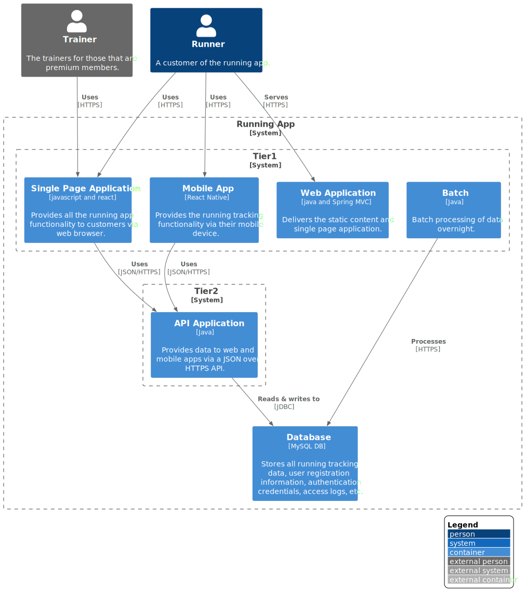

# 1.1 Container Diagram

**Level 2: Container diagram**

<!-- We now start to break down each individual part of the overview context into containers. -->

Each part of our application is a two tier app, which means we have a code layer for presentation and one for business logic. The presentation layer on mobile is coded on native code and fetches data from the API via RESTful calls. 

The same pattern is observed with our Web Dashboard application, which retrieve data from the API layer and serve the HTML pages to the clients. 

<!-- Once you understand how your system fits in to the overall IT environment, a really useful next step is to zoom-in to the system boundary with a Container diagram. A "container" is something like a server-side web application, single-page application, desktop application, mobile app, database schema, file system, etc. Essentially, a container is a separately runnable/deployable unit (e.g. a separate process space) that executes code or stores data.

The Container diagram shows the high-level shape of the software architecture and how responsibilities are distributed across it. It also shows the major technology choices and how the containers communicate with one another. It's a simple, high-level technology focussed diagram that is useful for software developers and support/operations staff alike. -->
