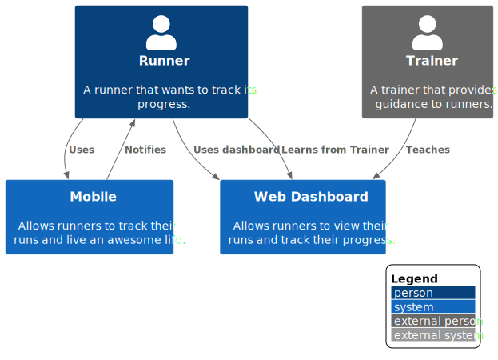

# 1 System Context Diagram

**Level 1: System Context**

The system context diagram represents a high-level overview of the interactions of the main components of the current architecture.

**Primary Elements**

There are currently one main user and two main components on this application. The primary elements are as follow:

- Our main users are runners that want to track and improve their running habits. These persons range from teens to seniors of all genders. 

- The first main component is the mobile application, designed to allow users to select a running program, track their runs with GPS data , count calories of each run , and enhance the running experience with a music playlist. 

- The second main component is a web dashboard that is designed to give users an overview of their runs and track their progress over time. They can also manage their accounts and purchase advanced plans with live trainer support.

**Secondary Elements**

- Trainers are professional runners that provide services guiding our runners into their journey.