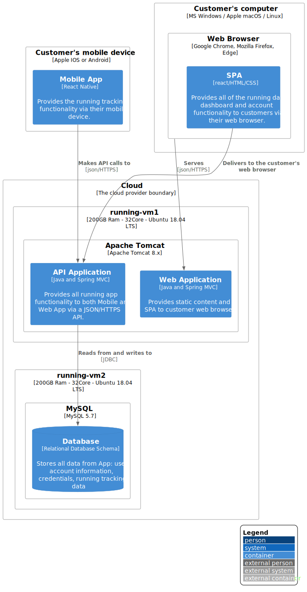

# 2 Current Deployment Diagram

**Deployment diagram**

This section we view how containers in the static model are mapped to infrastructure. 

Currently we have the mobile app installed on the client directly fetching data from the single API server instance. The executable files are hosted by the respective platform marketplaces.

There are two VM instances of 200GB RAM and 32vCPUs. On the first instance , we have:

- our web server that delivers a SPA app and static content to the web clients. The SPA then runs on the browser and communicates directly to the API. 

- the API layer is also on the the first VM instance and receives all requests from reads and writes all data to the database. 

The Database is installed on the second VM of the same size , and it runs a single MySQL database instance that is managed by our cloud services provider.

