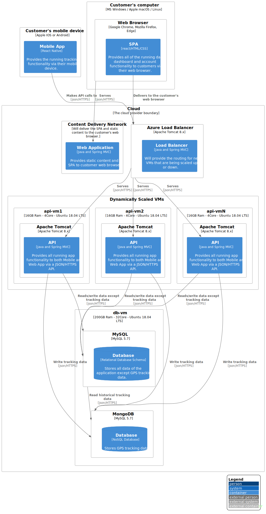

# 3 One Month Plan

**One Month Attack Plan**

Analyzing our users habits, we can notice that most of them follow conventional running times of early morning and end of day. This is causing our servers to be overloaded at these times and vastly underutilized the rest of the day, specially at night. 

To improve the user experience for our consumers, we will do the following modifications to our architecture:

In order to maximize the elasticity of the resources, we will add a load balancing layer in front our API services and we will host this services into many more VMs to be able to scale up and down throughout the day. Due to this migration , we will be able to reduce the size of the actual VM Instance 1.

Also, the mobile app will be modified to send each individual point of the tracking data at a smaller intervals, therefore avoiding large chunks of data coming in at once. Therefore the "STOP RUN" functionality of our app will only carry the overall run directly to the dashboard tables processed at the client mobile phone. 

For the Database server we will create a second Database responsible for write-intensive GPS tracking data that is provided on each run coming from the mobile apps via API. Each run will then have the entry to the overall data on the dashboard tables but if the client want to view the exact tracking of the run it will be linked to this data. This aims to remove the write overhead from the tables that are currently responsible for the tracking data separating it from the read part of the application.

**Proposed Solution for main problems**

As listed on our overview page, some of the main problems we have are:

- the app is not responsive during a run, especially trying to start and stop it

We will refactor the Mobile application to send each individual GPS tracking point to a new API endpoint, which in turn will save each individual point at a separate NoSQL database. On this same refactor we will have the mobile app create an overview of the run and when the customer hits STOP RUN , we will save the overview directly on the dashboard tables already processed, with a link to the NoSQL data points of the run GPS trail. 

- some customers mentioned that their runs are disappearing from the web dashboard

With the above refactor we will reduce the peaks of CPU processing on both API and Database servers, therefore reducing the overall unavailability of the application. We will also get rid of the processing overnight batches and make the dashboard data faster to read.

- when customers finish a run, it takes more than one day to view on the dashboard

As we mentioned, by refactoring the mobile app to send individual points and an overview of the run at the end, we will no longer have to process the data overnight, therefore saving resources.

**Proposed Solution for secondary problems**

- Reduce cost of total cloud account

By adding a load balancer and distributing the service layer we are now able to scale the VMs and fine tune the amount of services provided ,  scaling up at peak times and down on reduced usage times.