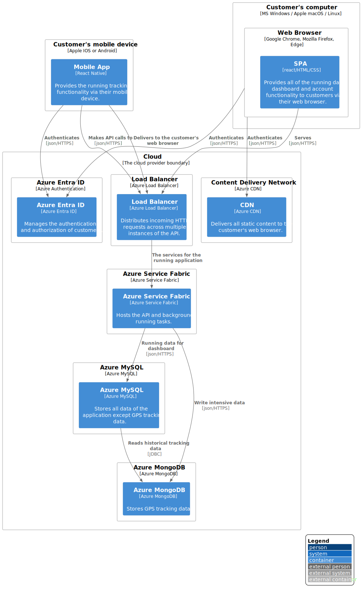

# 4 Long Term Plan

**Deployment diagram**

This section we view how containers in the static model are mapped to infrastructure. 

Currently we have the mobile app installed on the client directly fetching data from the API server. The installation files are served to the users phone by the respective platform marketplaces.

Our web server is already on Azure cloud, and its deployed on a single VM using IIS as a web server. The code also fetches data from the API layer. 

The API layer reads and writes all data from a single instance MySQL server. 

A deployment diagram allows you to illustrate how containers in the static model are mapped to infrastructure. This deployment diagram is based upon a UML deployment diagram, although simplified slightly to show the mapping between containers and deployment nodes. A deployment node is something like physical infrastructure (e.g. a physical server or device), virtualised infrastructure (e.g. IaaS, PaaS, a virtual machine), containerised infrastructure (e.g. a Docker container), an execution environment (e.g. a database server, Java EE web/application server, Microsoft IIS), etc. Deployment nodes can be nested.

**Scope**: A single software system.

**Primary elements**: Deployment nodes and containers within the software system in scope.

**Intended audience**: Technical people inside and outside of the software development team; including software architects, developers and operations/support staff.