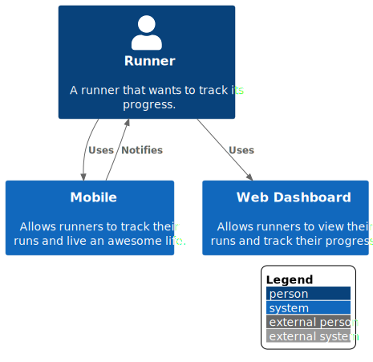

# Overview: Running App

# Software Architecture Course

**Project Part 1**

The goal of the running application is to allow users to track their running habits and get motivated by visualizing their progress.

Unfortunately, customers have been complaining about some problems, and our business is losing customers to the competition. 

In this document we have devised a one month plan to tackle the three immediate pain points with an improve in our software architecture.

**Primary Goals**

- the app is not responsive during a run, especially trying to start and stop it
- some customers mentioned that their runs are disappearing from the web dashboard
- when customers finish a run, it takes more than one day to view on the dashboard

**Secondary Goals**

- Reduce cost of total cloud account

**Scope**:Our Running application System and their interactions

**Intended audience**: CEO, CTO, and CFO are the primary audience for this presentation. Eventually it will be extended to the development team in order to provide clarity on the goals to follow ahead.

**Assumptions**: 